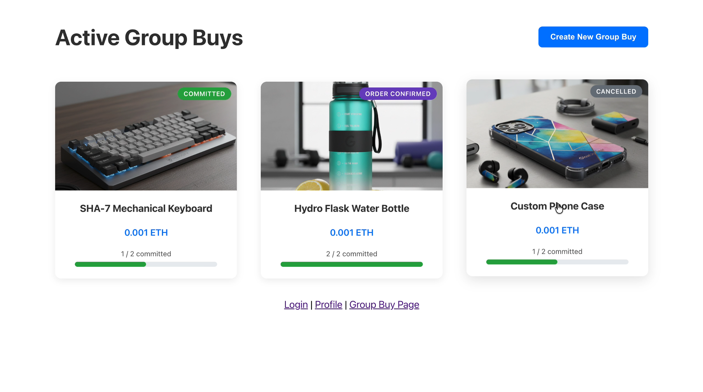
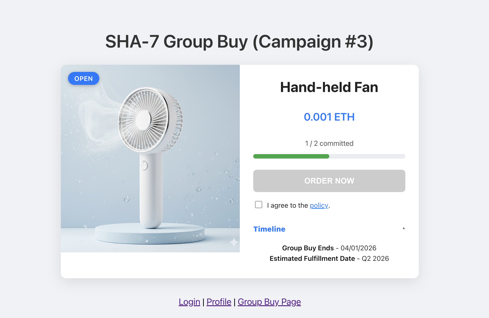
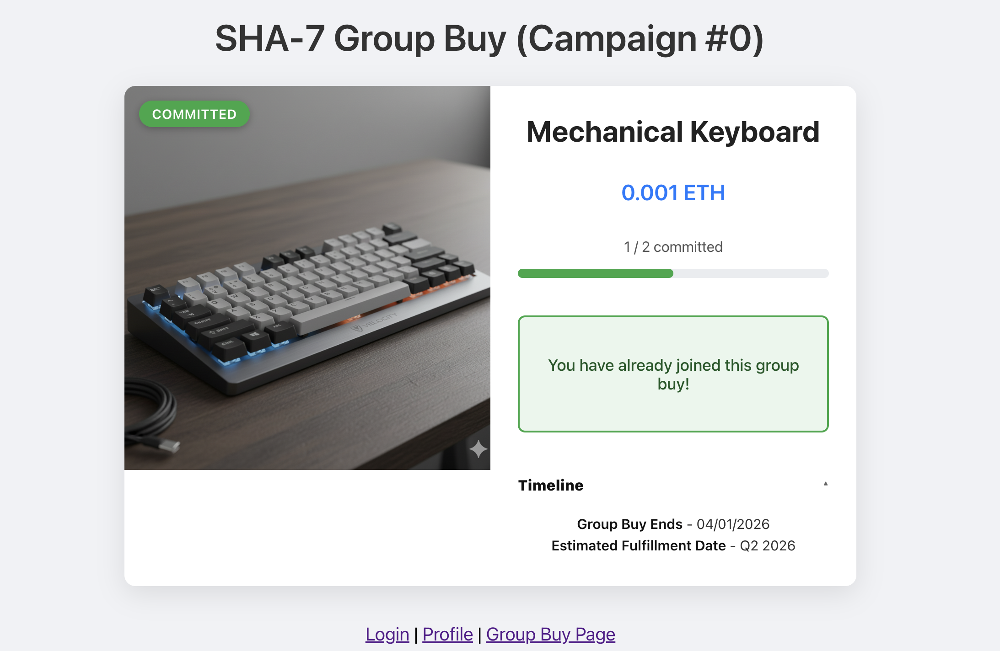
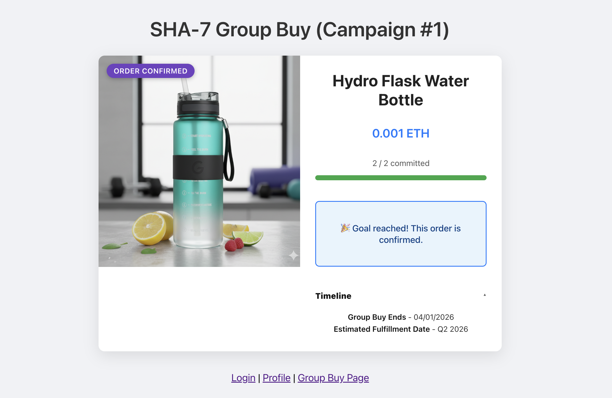
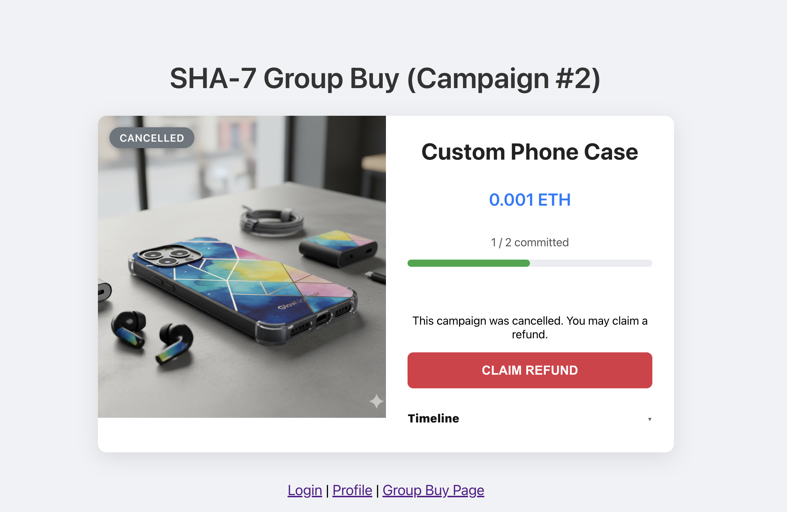
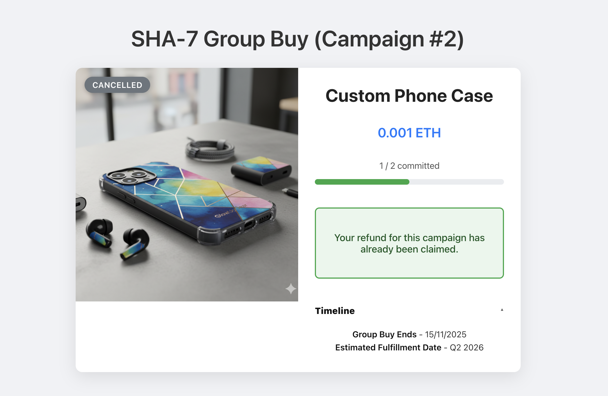

# SHA-7 GROUP BUY PROJECT

Welcome to the repository for the EE4032 SHA-7 Group Buy project! Our deployed project can be found [here](https://ee4032-sha-7.github.io/sha-7-frontend/). 

We give credits to [the template repository](https://github.com/marcotom/EE4032) for the building block of the code that allowed us to put together the project.

## Available Scripts

In the project directory, you can run:

### `npm run build`

Builds the app for production to the `build` folder.\
It correctly bundles React in production mode and optimizes the build for the best performance.

The build is minified and the filenames include the hashes.\
Your app is ready to be deployed!

See the section about [deployment](https://facebook.github.io/create-react-app/docs/deployment) for more information.

### `npm start`

Runs the app in the development mode.\
Open [http://localhost:3000](http://localhost:3000) to view it in your browser.

The page will reload when you make changes.\
You may also see any lint errors in the console.

## Interacting with the app

From the home page, you may click on each item to view more details about it.

### Open Group Buy

User may join an `Open` Group Buy by committing the amount of `ETH` specified for the product.

### Committed Group Buy

Once the user has joined the Group Buy, the page will reflect that they have `Committed` to it.

### Order Confirmed

Once the Minimum Order Quantity (MOQ) has been met, the user will be able to see the status `Order Confirmed` reflect on the product page
to know that production has begun or will begin shortly.

### Cancelled Group Buy

In the event that a Group Buy which the user has committed to is `Cancelled`, they can seek a refund by pressing the button 
`CLAIM REFUND` to process their individual refunds.

The page will update after the refund is claimed to reflect this status.

## Deployment

On each merge to the `main` branch, the `yml` file found under `.github/workflows/deploy.yml` will run 
an automatic deployment to our site hosted on GitHub pages. No further action from the developer is required
for deployment.

## Smart Contract

The smart contract used in this project can be found at `src/contracts/GroupBuy.sol`. This is written in the 
Solidity programming language and deployed on Remix.

## Bugs and known issues

Using the refresh button on a page within the Group Buy landing page or product page leads to errors. Please click on the `Group Buy Page`
on the toolbar at the bottom of the page to refresh the page instead. Thank you!

