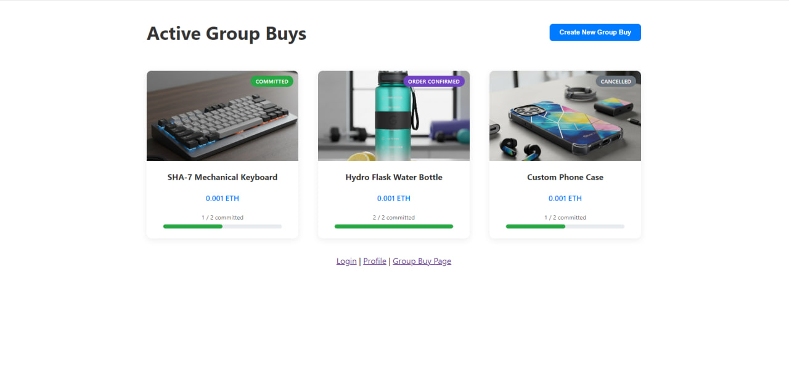

# SHA-7 FRONTEND REPOSITORY

Welcome to the repository for the EE4032 SHA-7 Group Buy project! Credits to [the template repository](https://github.com/marcotom/EE4032)
for the building block of the code that allowed us to put together the project. Our deployed project can be found [here](https://ee4032-sha-7.github.io/sha-7-frontend/). 

## Available Scripts

In the project directory, you can run:

### `npm run build`

Builds the app for production to the `build` folder.\
It correctly bundles React in production mode and optimizes the build for the best performance.

The build is minified and the filenames include the hashes.\
Your app is ready to be deployed!

See the section about [deployment](https://facebook.github.io/create-react-app/docs/deployment) for more information.

### `npm start`

Runs the app in the development mode.\
Open [http://localhost:3000](http://localhost:3000) to view it in your browser.

The page will reload when you make changes.\
You may also see any lint errors in the console.

## Deployment

On each merge to the `main` branch, the `yml` file found under `.github/workflows/deploy.yml` will run 
an automatic deployment to our site hosted on GitHub pages. No further action from the developer is required
for deployment.

## Smart Contract

The smart contract used in this project can be found at `src/contracts/GroupBuy.sol`. This is written in the 
Solidity programming language and deployed on Remix.

